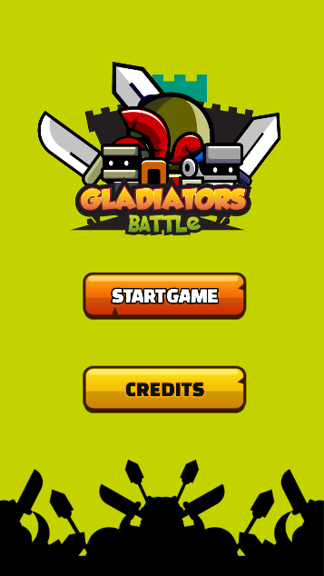
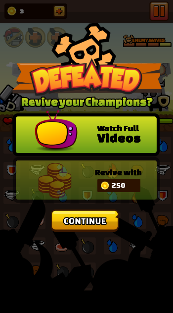
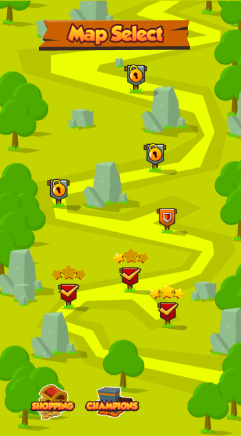
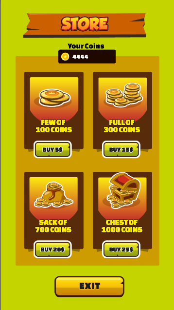
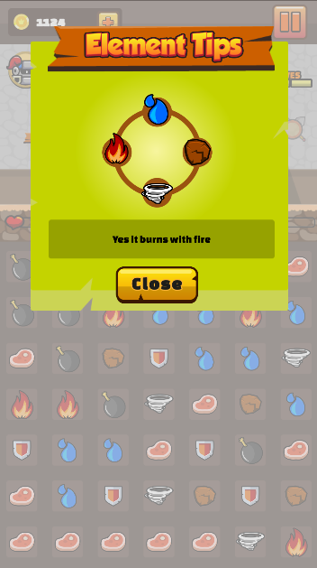
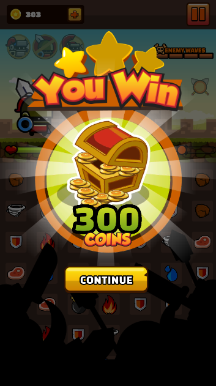
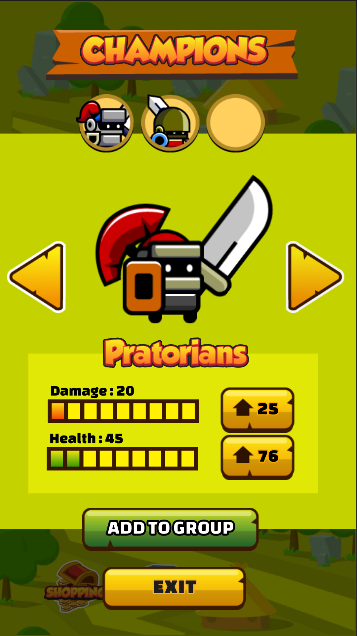
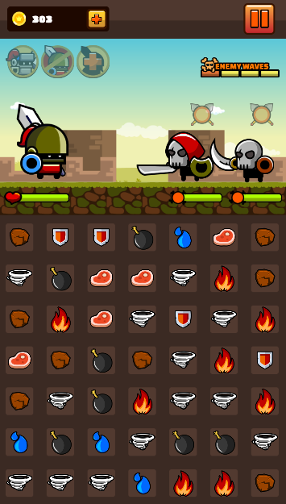
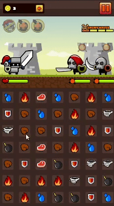
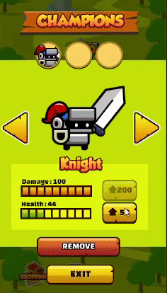

# Замечание
Данный проект был сделан по данным ресурсам - https://craftpix.net/product/gladiators-2d-game-kit/  
В связи с авторскими правами, в публичной версии проекта отсутствуют спрайты и текстуры

# Gladiators
Пошаговая match 3 игра с элементами RPG, цель которой является выбор одинаковых элементов, после которого происходит боевка  

# Вещи, реализованные в проекте
* Даже при условии того, что в проекте более 105 классов, нет огромных запутанных систем
* Карта уровней с сохранением прогресса
* Магазин персонажей с возможностью открытия персонажей и их улучшения
* Выбор списка персонажей за которых будем играть 
* Настройки для уровней в виде волн врагов, с конфигурацией каждого(здоровье и урон), настройка заднего плана, элементов поля, размера выигрыша 
* Система возрождения 
* Система проигрыша
* Различное поведение персонажа при выборе различных элементов
* Магазин монет
* Меню с подсказками
* Рестарт игровой сцены с сохранением выбранных персонажей и уровня
* Игровая сцена, действия на которой ограничены(ничего сломать нельзя) 

# Демонстрация проекта
|   |   |   |
| :------------ |:---------------:| -----:|
|       |  |  |
|     |        |    |

  
  

# Плагины, использованные в проекте
* DOTween
* Zenject
* TextMeshPro
* UniTask
